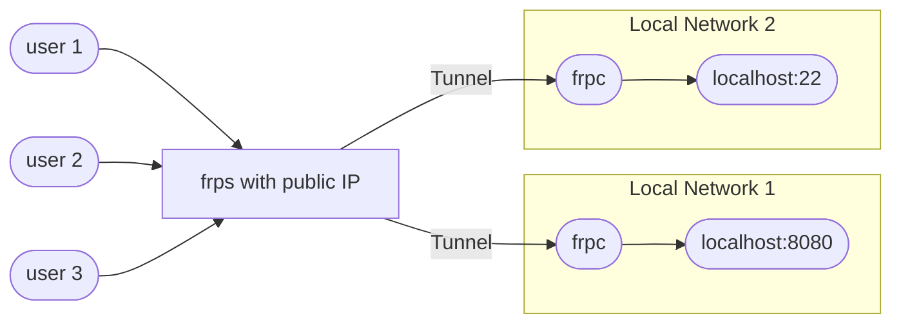

# FRP 使用指南

[[TOC]]

## 1. FRP 简介

FRP 是一个由 Go 编写的高性能的反向代理应用，支持 TCP、UDP、HTTP、HTTPS 等协议。它可以轻松地进行内网穿透，对外网提供服务。其 GitHub 仓库为 [fatedier/frp](https://github.com/fatedier/frp)。

FRP 分为客户端和服务端分别称为 frpc 和 frps，客户端用于连接内网的应用程序，服务端用于提供代理服务。



FRP 还提供管理界面，可以通过浏览器访问管理界面，查看代理服务的状态，可以查看每日的流量情况。

大多数情况下我们只需要 TCP 代理即可，HTTP/HTTPS 代理可以支持更多功能，但是需要配置更多参数。

## 2. Docker 部署

比较流行的 FRP 镜像是由 [@snowdreamtech](https://hub.docker.com/u/snowdreamtech) 提供的，包括 [frpc](https://hub.docker.com/r/snowdreamtech/frpc) 和 [frps](https://hub.docker.com/r/snowdreamtech/frps) 两个镜像。

拉取镜像：

```bash
docker pull snowdreamtech/frpc
docker pull snowdreamtech/frps
```

配置文件内可以使用类似 `{{ .Envs.NAME }}` 的格式可以读取环境变量。

下面的示例是将本地的 `http://127.0.0.1:4090` 映射到公网服务器的 `http://xxx.xxx.xxx.xxx:4090`。

### 2.1 客户端配置

客户端 frpc 配置文件 `frpc.toml`：

```toml
serverAddr  = {{ .Envs.FRP_SERVER_ADDR }}
serverPort  = {{ .Envs.FRP_SERVER_PORT }}
token       = {{ .Envs.FRP_SERVER_TOKEN }}

[app]
type        = "tcp"
remotePort  = 4090
localIp     = {{ .Envs.APP_HOST }}
localPort   = 4090
```

Docker Compose 配置文件 `docker-compose.yml`：

```yaml
version: "3"
services:
  frpc:
    container_name: frpc
    restart: always
    image: snowdreamtech/frpc:0.53.2
    volumes:
      - /etc/localtime:/etc/localtime:ro
      - /etc/timezone:/etc/timezone:ro
      - ./frpc.toml:/etc/frp/frpc.toml:ro
    network_mode: host
    environment:
      FRP_SERVER_ADDR: xxx.xxx.xxx.xxx  # 公网服务器地址
      FRP_SERVER_PORT: 9870             # 服务隧道端口
      FRP_SERVER_TOKEN: xxxxxx          # 服务隧道密码
      APP_HOST: 127.0.0.1               # 本地程序地址
    logging:
      driver: "json-file"
      options:
        max-size: "1m"
networks:
  host:
    name: host
    external: true
```

此处直接使用 `host` 网络用于读取宿主机的应用程序，也可以使用自定义网络来通信。

启动客户端：

```bash
docker-compose up -d
```

关闭客户端：

```bash
docker-compose down
```

### 2.2 服务端配置

服务端 frps 配置文件 `frps.toml`：

```toml
bindPort        = {{ .Envs.FRP_SERVER_PORT }}
token           = {{ .Envs.FRP_SERVER_TOKEN }}

dashboardAddr   = "0.0.0.0"
dashboardPort   = {{ .Envs.FRP_ADMIN_PORT }}
dashboardUser   = {{ .Envs.FRP_ADMIN_USER }}
dashboardPwd    = {{ .Envs.FRP_ADMIN_PASS }}
```

注意下面开放的三个端口：

- `9870`：服务隧道端口，用于提供代理服务
- `7890`：管理界面
- `4090`：用于客户端连接的端口

将下面的 `docker-compose.yml` 文件保存在不同位置。

```yaml
version: "3"
services:
  frps:
    restart: always
    container_name: frps
    image: snowdreamtech/frps:0.53.2
    volumes:
      - /etc/localtime:/etc/localtime:ro
      - /etc/timezone:/etc/timezone:ro
      - ./frps.toml:/etc/frp/frps.toml
    ports:
      - 9870:9870
      - 7890:7890
      - 4090:4090
    environment:
      FRP_SERVER_PORT: 9870     # 服务隧道端口
      FRP_SERVER_TOKEN: xxxxxx  # 服务隧道密码
      FRP_ADMIN_PORT: 7890      # 管理界面端口
      FRP_ADMIN_USER: username  # 管理界面用户名
      FRP_ADMIN_PASS: password  # 管理界面密码
    networks:
      - frps
    logging:
        driver: "json-file"
        options:
          max-size: "1m"
networks:
  frps:
    external: true
```

启动服务端：

```bash
docker network create frps
docker-compose up -d
```
